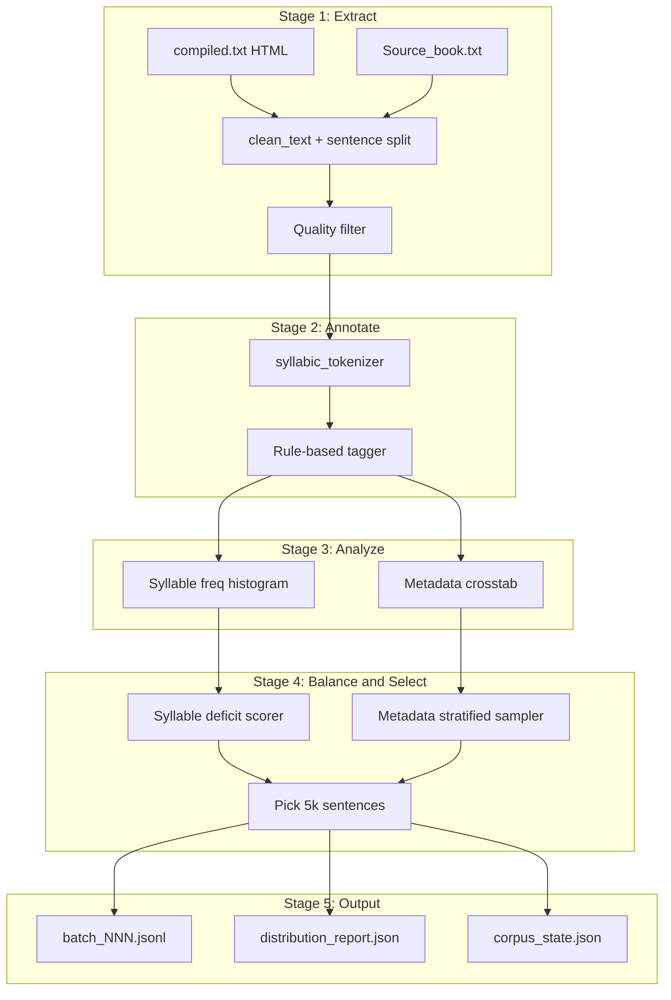

# Balanced ASR Recording Dataset (50k lines)

## Context

The existing [syllabic_tokenizer.py](tokenizer/syllable-tokenizer/scripts/syllabic_tokenizer.py) provides syllable tokenization and `clean_text()` for Devanagari normalization. There is **no** dataset builder, metadata schema, or balancing logic yet.

| Source | Usable sentences | Sector tag |
|--------|------------------|------------|
| [compiled.txt](tokenizer/syllable-tokenizer/compiled.txt) | Millions (HTML news) | `news` |
| [Source_book.txt](tokenizer/syllable-tokenizer/Source_book.txt) | ~2,600 (literary prose) | `literature` |

`Source_book.txt` alone cannot reach 50k; **compiled.txt is the primary pool**, with the book used to boost `literature` sector coverage.

---

## Target Output Schema

Each selected sentence becomes one JSONL record:

```json
{
  "id": "asr_00004231",
  "text": "नेपाल एक सुन्दर देश हो।",
  "syllables": ["ने", "पा", "ल", " ", "ए", "क", " ", "..."],
  "syllable_count": 12,
  "unique_syllables": ["ने", "पा", "ल", "ए", "क", "..."],
  "tense": "present",
  "polarity": "positive",
  "gender": "neutral",
  "sector": "news",
  "batch_id": 1,
  "source_file": "compiled.txt"
}
```

Metadata values (rule-based):

- **tense**: `past` | `present` | `future` | `mixed`
- **polarity**: `positive` | `negative` | `neutral`
- **gender**: `masculine` | `feminine` | `neutral` (grammatical/subject cues in text)
- **sector**: `news` | `literature` | `formal` | `conversational` (source + formality heuristics)

---

## Architecture



---

## New Module Layout

Add under [tokenizer/syllable-tokenizer/](tokenizer/syllable-tokenizer/):

```
scripts/dataset_builder/
  __init__.py
  extract.py          # HTML → sentences, dedup, quality filter
  annotate.py         # Rule-based tense/polarity/gender/sector
  syllable_stats.py   # Per-sentence + corpus syllable frequency
  balance.py          # Multi-criteria selection algorithm
  analyze.py          # Distribution reports (JSON + optional plots)
  pipeline.py         # CLI orchestrator for incremental batches
dataset/asr_corpus/
  pool/               # Annotated candidate pool (chunked JSONL)
  batches/            # batch_001.jsonl … batch_010.jsonl
  reports/            # Per-batch distribution reports
  corpus_state.json   # Selected IDs, cumulative syllable counts, metadata counts
```

Reuse existing tokenizer via:

```python
from syllabic_tokenizer import clean_text, get_lookup_tokens, tokenize
```

---

## Stage 1: Sentence Extraction

**compiled.txt parsing**
- Extract text inside `<p>...</p>` tags (regex or `html.parser`)
- Run `clean_text()` to strip non-Devanagari
- Split on `।`, `!`, `?` into individual sentences
- Tag `sector=news`, `source_file=compiled.txt`

**Source_book.txt parsing**
- Skip line 1 (TOC) and lines 782–786 (OCR noise)
- Split long prose lines into sentences (same delimiters)
- Strip inline page markers (`/१`, story titles)
- Tag `sector=literature`

**Quality filters** (drop sentence if any fail):
- Length: 5–80 syllables (ASR-friendly; tunable)
- At least 3 content syllables (exclude fragments)
- No excessive unknown/unmatched chars after tokenization
- Dedup via normalized text hash

**Pool sizing**: For batch 1, extract ~50k–100k candidate sentences from compiled.txt (streaming, no full 1.8GB load into memory). Book sentences merged in full (~2,400 after filtering).

---

## Stage 2: Rule-Based Annotation

Implement pattern matchers in [annotate.py](tokenizer/syllable-tokenizer/scripts/dataset_builder/annotate.py):

| Field | Heuristic approach |
|-------|-------------------|
| **tense** | Regex on verb endings: past (`ए`, `यो`, `थिय`, `गर्`, `भय`), present (`छ`, `हुन्छ`, `छन्`, `हो`), future (`नेछ`, `लानेछ`, `हुनेछ`, `ने`). Last matching pattern wins; multiple → `mixed` |
| **polarity** | Negative if contains `छैन`, `नभ`, `नह`, `नग`, `नि?`, standalone `न `; positive if contains praise/affirmation lexicon; else `neutral` |
| **gender** | Feminine: `इन्`, `छिन्`, `गइन्`, `उनी` + feminine verb agreement, `की/गी`; Masculine: `उ`, `उस`, `गयो`, `गरे`; else `neutral` |
| **sector** | Primary from source (`news`/`literature`); override to `formal` if long formal register markers; `conversational` if direct speech (`भन्य`, `भन्`, quoted clauses) |

Rules will be stored in a configurable YAML/JSON file so you can tune patterns without code changes.

---

## Stage 3: Distribution Analysis

For each batch checkpoint, produce [analyze.py](tokenizer/syllable-tokenizer/scripts/dataset_builder/analyze.py) reports:

**Syllable balance metrics**
- Global frequency of each syllable token (excluding ` `, `।`, `?`, `!`)
- Coefficient of variation (CV) across syllable types — lower = more balanced
- Coverage: % of lookup vocab (1,782 tokens) represented
- Rare syllable count (freq below threshold)

**Metadata balance metrics**
- Counts per tense, polarity, gender, sector
- Crosstab (e.g., tense × gender)
- Deviation from uniform target (% off ideal equal split)

Reports saved to `dataset/asr_corpus/reports/batch_NNN_report.json`.

---

## Stage 4: Balanced Selection Algorithm

Two-objective greedy selection in [balance.py](tokenizer/syllable-tokenizer/scripts/dataset_builder/balance.py):

### 4a. Metadata stratification (hard constraint)

Target equal counts across each metadata axis (within ±5% tolerance):
- 4 tense × 3 polarity × 3 gender × 4 sector = 144 cells
- For 5k batch: ~35 sentences per cell ideal; relax to nearest achievable if pool is sparse
- Round-robin fill: pick from underfilled cells first

### 4b. Syllable-type frequency (soft objective)

Within each metadata cell, score candidate sentences:

```
score(s) = Σ  max(0, target_count[syll] - current_count[syll])
           for syll in unique_syllables(s)
```

- `target_count[syll]` = total_syllables_in_corpus / num_syllable_types (uniform target)
- Pick highest-scoring sentence that passes quality + dedup
- Update cumulative syllable counts after each pick

### 4c. Incremental rebalancing

When adding batch N (cumulative target = N × 5k):
- Load `corpus_state.json` (selected IDs + cumulative counts)
- Score new candidates against **cumulative** deficits, not just batch-local
- This ensures batch 10 still improves global syllable balance

---

## Stage 5: Incremental Batch Workflow

CLI entry point:

```bash
# Batch 1: extract pool, select first 5k
python scripts/dataset_builder/pipeline.py run-batch \
  --batch-id 1 --target-size 5000 \
  --pool-source compiled.txt --supplement Source_book.txt

# Batch 2–10: reuse pool, exclude prior selections
python scripts/dataset_builder/pipeline.py run-batch \
  --batch-id 2 --target-size 5000

# Analyze only (no selection)
python scripts/dataset_builder/pipeline.py analyze --batch-id 3

# Merge all batches into final corpus
python scripts/dataset_builder/pipeline.py merge --output dataset/asr_corpus/corpus_50k.jsonl
```

Each batch produces:
1. `batches/batch_NNN.jsonl` — 5k selected sentences
2. `reports/batch_NNN_report.json` — before/after balance metrics
3. Updated `corpus_state.json`

---

## Dependencies

Extend [requirements.txt](tokenizer/syllable-tokenizer/requirements.txt):

```
pandas          # already present
tqdm            # streaming progress
pyyaml          # annotation rule config
```

Optional: `matplotlib` for histogram plots (can defer to JSON-only reports initially).

---

## Validation Checkpoints

After each 5k batch, verify:

| Metric | Target |
|--------|--------|
| Syllable CV | Decreasing trend across batches |
| Lookup coverage | ≥ 85% of 1,782 syllables by batch 10 |
| Metadata cells | Each axis within ±10% of uniform |
| Sentence length | Median 15–35 syllables |
| Dedup | Zero duplicate texts |

---

## Risks and Mitigations

- **Rule-based annotation accuracy**: Rules will mislabel some sentences. Mitigation: log low-confidence cases (conflicting patterns) for manual review; allow rule YAML tuning between batches.
- **Syllable balance vs metadata balance conflict**: Metadata stratification takes priority; syllable scoring operates within cells. If conflict persists, widen metadata tolerance slightly.
- **Literature underrepresentation**: Book contributes ~2.4k max. For `literature` sector target, cap at available pool and redistribute quota to other sectors proportionally.
- **Memory on compiled.txt**: Stream line-by-line; never load full 1.8GB file.

---

## Implementation Order

1. **extract.py** + quality filters — unblock candidate pool
2. **annotate.py** + rules YAML — metadata on pool
3. **syllable_stats.py** + **analyze.py** — distribution visibility
4. **balance.py** — selection algorithm
5. **pipeline.py** — wire batch loop, state management
6. Run batch 1 (5k), review report, tune rules/thresholds
7. Repeat batches 2–10 to 50k
