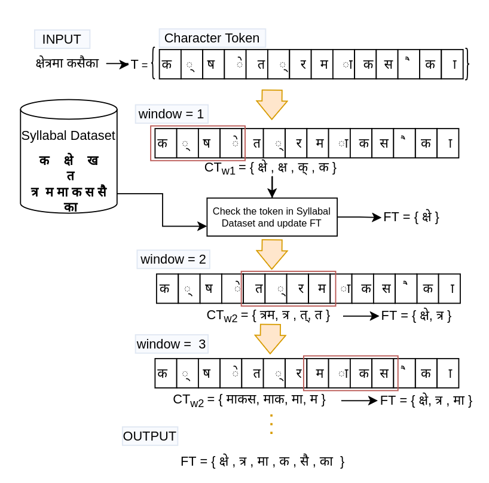

# Pronunciation-Aware Syllable Tokenizer for Nepali

## Abstract
The Automatic Speech Recognition (ASR) has come up with significant advancements over the course of several decades, transitioning from a rule-based method to a statistical approach, and ultimately to the use of end-to-end (E2E) frameworks. This phenomenon continues with the progression of machine learning and deep learning methodologies. The E2E approach for ASR has demonstrated predominant success in the case of resourceful languages with larger annotated corpus. However, the accuracy is quite low for low-resourced languages such as Nepali. In this regard, language-specific tools such as tokenizers seem to play a vital role in improving the performance of the E2E model for low-resourced languages like Nepali. In this paper, we propose a pronunciation-aware syllable tokenizer for the Nepali language which improves the results of the E2E model. Our experiment confirm that the introduction of the proposed tokenizer yields better performance with the Character Error Rate (CER) 8.09% compared to other language-independent tokenizers.


## How it works?
The image below shows the working of the proposed tokenizer. The deails are explained in the [paper](https://aclanthology.org/2023.icon-1.4/) (Algorithm 1: Syllabic Tokenizer for
Nepali).
<p align="left">
  
</p>


### Generating the vocabulary lookup
The script `scripts/generate_vocab_lookup.py` generates the vocabulary lookup save to `dataset/nepali_syllable_vocab_lookup.vocab` file.

```bash
python scripts/generate_vocab_lookup.py
```

### Tokenier
The tokenizer is simple function that takes a sentence as input and returns the tokenized output. The script `scripts/syllabic_tokenizer.py` demonstrates the usage of the tokenizer.

```bash
python scripts/syllabic_tokenizer.py
```

Use tokenizer as library
```python
>>> import scripts.syllabic_tokenizer as tokenizer
>>> lookup = tokenizer.get_lookup_tokens()
>>> len(lookup)
1782
>>> tokens = tokenizer.tokenize('के छ तिम्रो हालचाल?', lookup)
>>> len(tokens)
12
>>> tokens
['के', ' ', 'छ', ' ', 'ति', 'म्रो', ' ', 'हा', 'ल', 'चा', 'ल', '?']
>>>
```


### Generating the token vocabulary for your dataset
Foe example the text dataset for the SLR54 can be generated using the script `scripts/extract_slr54_transcripts.py` as follows:

```bash
python scripts/extract_slr54_transcripts.py
```

To generate the vocabulary we can use the script `scripts/generate_vocab.py` as follows:

syntax:

```bash
python scripts/generate_vocab.py --input_file <input-file> --output_file <out-file> --lookup_file dataset/nepali_syllables_lookup.vocab
```

```bash
python scripts/generate_vocab.py --input_file dataset/oslr_transcripts/unique_transcripts.txt --output_file dataset/slr54.vocab --lookup_file dataset/nepali_syllables_lookup.vocab
```


## Citation
If you use this tokenizer, cite the [following paper](https://aclanthology.org/2023.icon-1.4/):
```
@inproceedings{rupak-raj-etal-2023-pronunciation,
    title = "Pronunciation-Aware Syllable Tokenizer for {N}epali Automatic Speech Recognition System",
    author = "Ghimire, Rupak Raj  and
      Bal, Bal Krishna  and
      Prasain, Balaram  and
      Poudyal, Prakash",
    editor = "D. Pawar, Jyoti  and
      Lalitha Devi, Sobha",
    booktitle = "Proceedings of the 20th International Conference on Natural Language Processing (ICON)",
    month = dec,
    year = "2023",
    address = "Goa University, Goa, India",
    publisher = "NLP Association of India (NLPAI)",
    url = "https://aclanthology.org/2023.icon-1.4/",
    pages = "36--43"
}
```

__Note__: The date of publication of the literature is 2023, but code is reproduced and published in 2026 May. Please use the date of publication of the literature for citation.

## Five-corpus distribution analysis

For streaming per-corpus and exact cross-corpus-deduplicated analysis, use
`python -m corpus_analysis.pipeline` from the `scripts` directory. The full
Google Cloud workflow, output definitions, validation procedure, and retrieval
instructions are documented in
[`../../docs/nepali_corpus_syllable_analysis.md`](../../docs/nepali_corpus_syllable_analysis.md).

## Diverse rare-aware final 50k corpus

The final-corpus workflow uses the exact-deduplicated union of the five raw
corpora, a square-root-tempered syllable target, MinHash-LSH lexical filtering,
and empirically calibrated multilingual-E5 cosine similarity. Preparation is
implemented as three bounded streaming passes: frequency/index construction,
bounded hash-reservoir selection, and final shortlist materialization. Full
records evicted from the bounded reservoirs are never cached. Normalized
Shannon entropy and Gini are the headline balance metrics; CV is retained only
as a diagnostic.

Coverage is reported at three distinct layers: tokenizer-emittable vocabulary,
five-corpus source support, and final selection coverage. The tokenizer derives
its match window from the pinned vocabulary, including the five-to-seven-code-
point entries that the previous fixed four-code-point window could not emit.
The configuration's 1,781 analytical entries are a non-whitespace integrity
count; the actual coverage denominator is 1,778 after excluding `।`, `?`, and
`!`. Resume checkpoints pin the tokenizer source SHA-256 as well as the lookup
vocabulary, and revalidate the complete emittable/unemittable inventory.
Hard semantic cutoffs and final nearest-neighbour audits use exact FAISS
`IndexFlatIP`. E5 is used for selection, while comparative semantic acceptance
against the previous 50k corpus uses held-out LaBSE embeddings.

Install the base and optional CPU ML dependencies on the 32-vCPU cloud VM:

```bash
python -m pip install -r tokenizer/syllable-tokenizer/requirements.txt
python -m pip install -r tokenizer/syllable-tokenizer/requirements-diversity.txt
```

Then run from `tokenizer/syllable-tokenizer/scripts`:

```bash
CLOUD_WORKERS="$(nproc)"

# Required bounded smoke test with one worker and all cores.
python -m dataset_builder.pipeline prepare-five-corpus-pool \
  --config ../configs/nepali_corpus_analysis.yaml \
  --input-root /data/nepali-corpora \
  --output-dir ../dataset/asr_corpus/five_corpus_pool_smoke_1 \
  --max-records-per-corpus 100000 --candidate-limit 250000 \
  --workers 1

python -m dataset_builder.pipeline prepare-five-corpus-pool \
  --config ../configs/nepali_corpus_analysis.yaml \
  --input-root /data/nepali-corpora \
  --output-dir ../dataset/asr_corpus/five_corpus_pool_smoke_all \
  --max-records-per-corpus 100000 --candidate-limit 250000 \
  --workers "$CLOUD_WORKERS"

python -m dataset_builder.pipeline compare-prepared-pools \
  --left ../dataset/asr_corpus/five_corpus_pool_smoke_1 \
  --right ../dataset/asr_corpus/five_corpus_pool_smoke_all

python -m dataset_builder.pipeline prepare-five-corpus-pool \
  --config ../configs/nepali_corpus_analysis.yaml \
  --input-root /data/nepali-corpora \
  --output-dir ../dataset/asr_corpus/five_corpus_pool \
  --candidate-limit 1200000 --workers "$CLOUD_WORKERS" --resume

python -m dataset_builder.pipeline build-diverse-final \
  --pool-dir ../dataset/asr_corpus/five_corpus_pool \
  --target-size 50000 \
  --baseline ../dataset/asr_corpus/final_50k_all_syllables.jsonl \
  --output ../dataset/asr_corpus/final_50k_diverse_rare.jsonl \
  --workers "$CLOUD_WORKERS" --resume

python -m dataset_builder.pipeline update-progress \
  --run-report ../dataset/asr_corpus/reports/final_50k_diverse_rare/report.json \
  --progress-file ../../../docs/technical_progress_report.md
```

Use `compare-prepared-pools` to verify preparation artifact equality across the
one-worker and all-core smoke runs on the same Python version and architecture.
Embedding and FAISS stages are reproducible only with the fixed model revisions,
software versions, quantization, seed, machine, and process/thread topology
recorded in the manifest.
For full acceptance comparison, keep the previous final 50k JSONL on the cloud
and pass it with `--baseline`.

## Synthetic ASR on the existing VM and Kaggle

The verified 20k text can be converted into a Gemini-TTS synthetic ASR package
without provisioning another Google Cloud VM or GPU. Preparation, synthesis, CPU
QC, SLR54 splitting, final acceptance, and SpeeChain export run on the existing VM;
Whisper and targeted MMS verification run in a private Kaggle GPU notebook. The
pipeline prepares training configurations but never executes ASR training.

Install `requirements-synthetic-asr.txt` and follow the complete phase gates in
[`../../docs/synthetic_asr_existing_vm_kaggle.md`](../../docs/synthetic_asr_existing_vm_kaggle.md).
